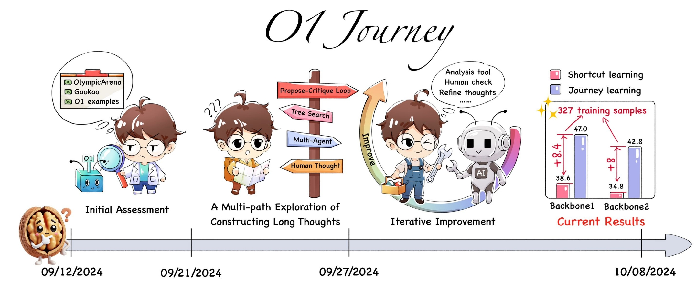

# Walnut Plan

        

## Introduction

The Walnut Plan aspires to be an open pioneer in the research of **complex reasoning** and **deep thinking** capabilities in Artificial Intelligence. Our mission is to explore, develop, and share innovative technologies that significantly enhance the complex reasoning abilities of large language models, while advocating for the principles of open science and knowledge sharing. Through relentless efforts, we aim to drive the evolution of AI from simple information processing tools to intelligent systems capable of deep thinking at the level of "Newton" and "Einstein".

## Mission

Guided by this grand vision, the Walnut Plan is committed to reshaping the paradigm of AI research. We believe that only through open, transparent, and collaborative approaches can we truly promote the democratization of AI technology for the benefit of all humanity. Our goals extend beyond technological breakthroughs to fostering a more open and responsible AI research ecosystem.

In the long term, the Walnut Plan will dedicate itself to developing a new generation of AI systems capable of assisting and even independently conducting scientific discoveries. We expect to accelerate the accumulation of human knowledge and innovation processes through the popularization of AI capabilities. At the same time, we are deeply aware of our significant responsibility and will always prioritize ensuring the safety and ethical development of AI, exploring new ways for AI and human intelligence to develop in synergy.

By establishing an interdisciplinary and inter-organizational research network, we aim to bring together top global talent to collectively tackle the frontier challenges in the AI field. We believe that only through collective wisdom and effort can we truly achieve leap-forward development in AI technology and make substantial contributions to human technological progress and social development.

The Walnut Plan is not just a research initiative, but a movement to drive the transformation of AI technology and scientific research culture. We invite all like-minded researchers, developers, and thinkers to join our ranks, to collectively write a new chapter in artificial intelligence, and to contribute to creating a more intelligent, open, and better future.

## Projects

### Project1: O1 Replication Journey: A Strategic Progress Report

[**Report**](https://github.com/GAIR-NLP/O1-Journey/blob/main/resource/report.pdf)

### Stay Tuned!